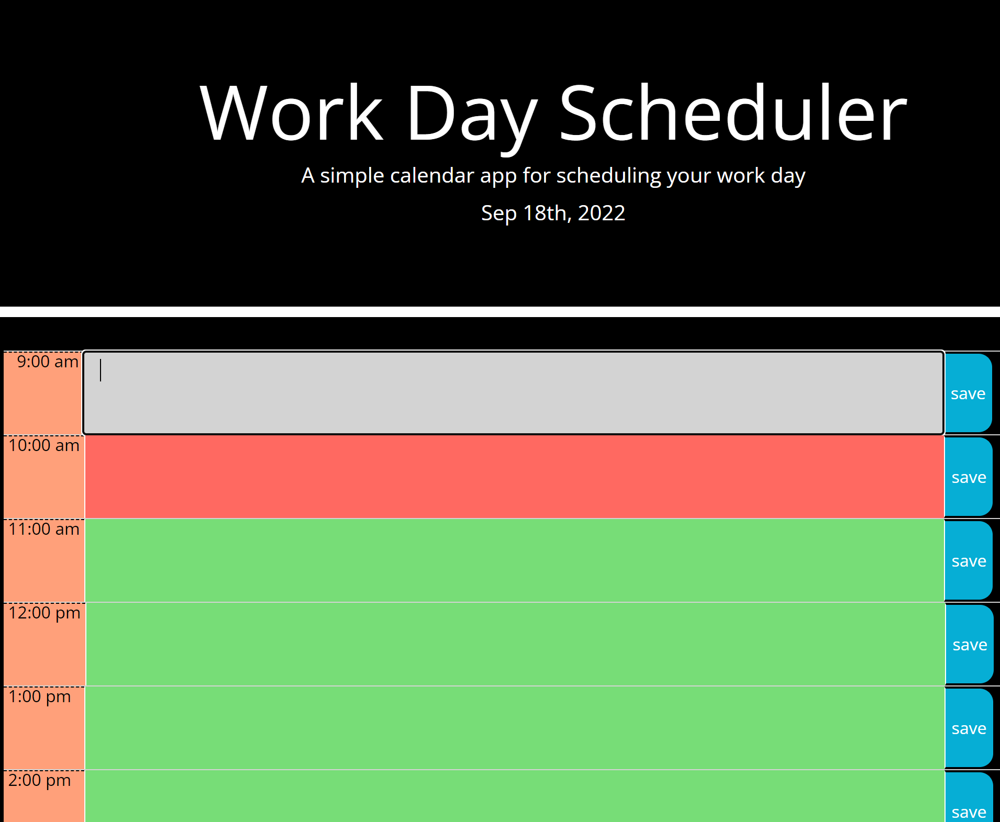
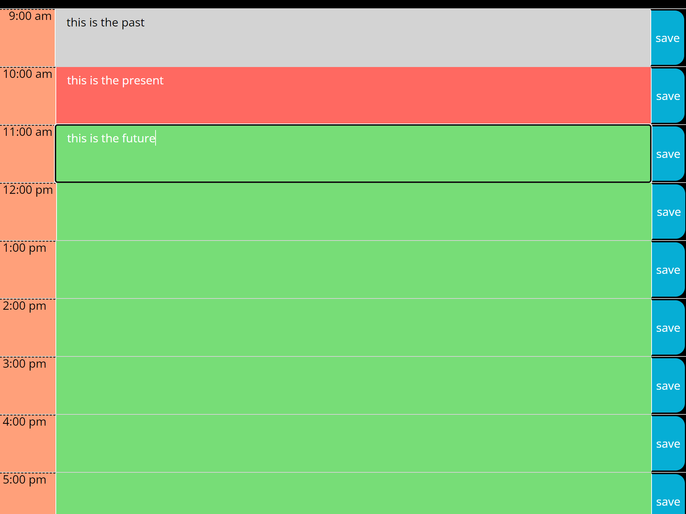

# a-canal-panama

## Description

I was tasked to use Jquery to create a work day scheduler.  This task seemed simple enough but after a bit of work I realized that even though JQuery made a lot of the tasks more concise I still needed to create logic that was very precise.  I struggled to get the text to persist after a refresh and how to target the timeblock individually.  
After working with my tutor I realized that not only did I need to parseInt the IDs on my text areas but i needed to parseInt the hour coming directly from moment.js.  This was surprising to me but after that I was able to get more of the functionaily working.  I also needed to use (this) to target the rows individually and that took a bit of trial and error.  I tweaked the colors to make it more comfortable for my eyes and I’m rather pleased with the results. 

## Installation 

## Usage 

 
 

## Credits
The people at Trilogy Education Services provided the HTML and CSS and I crafted the JavaScript file with JQuery.
-additional technology used includes google fonts, moment.js and bootstrap

## License

MIT License

Copyright (c) 2022 Timothy Barnaby

Permission is hereby granted, free of charge, to any person obtaining a copy
of this software and associated documentation files (the "Software"), to deal
in the Software without restriction, including without limitation the rights
to use, copy, modify, merge, publish, distribute, sublicense, and/or sell
copies of the Software, and to permit persons to whom the Software is
furnished to do so, subject to the following conditions:

The above copyright notice and this permission notice shall be included in all
copies or substantial portions of the Software.

THE SOFTWARE IS PROVIDED "AS IS", WITHOUT WARRANTY OF ANY KIND, EXPRESS OR
IMPLIED, INCLUDING BUT NOT LIMITED TO THE WARRANTIES OF MERCHANTABILITY,
FITNESS FOR A PARTICULAR PURPOSE AND NONINFRINGEMENT. IN NO EVENT SHALL THE
AUTHORS OR COPYRIGHT HOLDERS BE LIABLE FOR ANY CLAIM, DAMAGES OR OTHER
LIABILITY, WHETHER IN AN ACTION OF CONTRACT, TORT OR OTHERWISE, ARISING FROM,
OUT OF OR IN CONNECTION WITH THE SOFTWARE OR THE USE OR OTHER DEALINGS IN THE
SOFTWARE.
